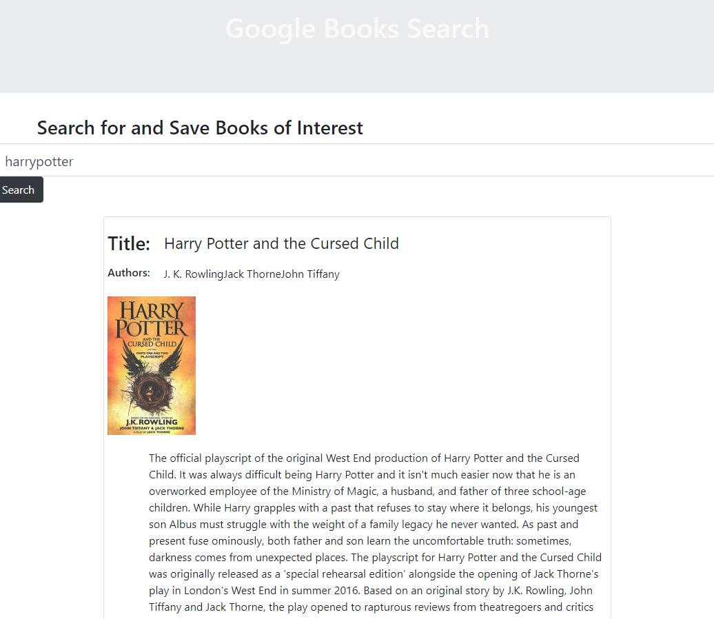

# Books  

## Table of Contents  
[About](#About)  
[Installation](#Installation)    
[Questions](#questions)   

## About Project  

This app was created with node/express/react and mongoDB using the google books api to provide the user with an interface to search through the google books catalog, save titles on to a dashboard and view information such as the author, image, and summary if provided. The user may also click the book to be redirected to its google page.
## Installation  

For local installation:  
Clone the repository and run "npm install" in the terminal to install dependencies. This app uses mongoDB so be sure to start an instance of mongod and mongo for the database adn create a "googlebooks" database. Run "npm start" in the terminal and go to localhost:3000 to view the site. Search for and add books, go to your saved books and view titles you saved, or deleted ones youve already read.

## Deployment  
This app was deployed using Heroku and MongoAtlas for hosting the database. Follow the link below to visit the deployed site.

[deployed-link](https://secure-tundra-75704.herokuapp.com/)  

## Preview

## Questions  
I had a tough time getting this one to work, initially git init-ed in an inside folder by accident, which caused initial errors, I decided to recreate the repo, which solved some issues, then when deploying to heroku, i found i made the same mistake and had to re create the repo again, fixed the error after reading through the logs 30 times, deployed, then got atlas errors where my db wasnt being connected, did some googling of the heroku logs, re did my whitelists *didnt change anything*, re inserted my env variable keys 20 time and finally got it working. If you run into any further bugs pls let me know! :)

[My Github](https://github.com/apemint)

